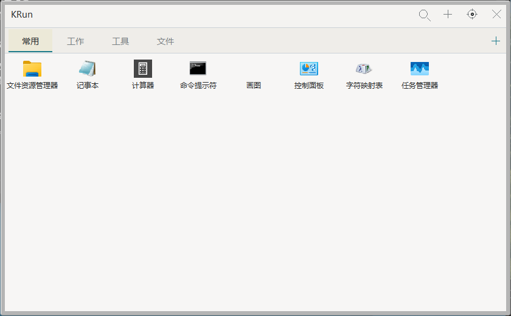
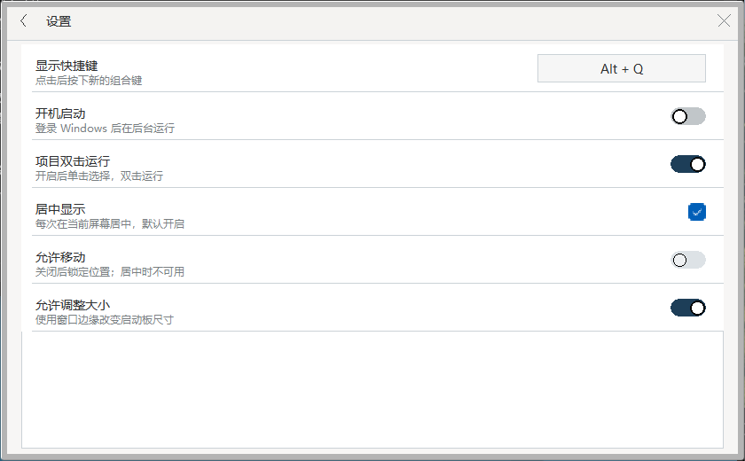
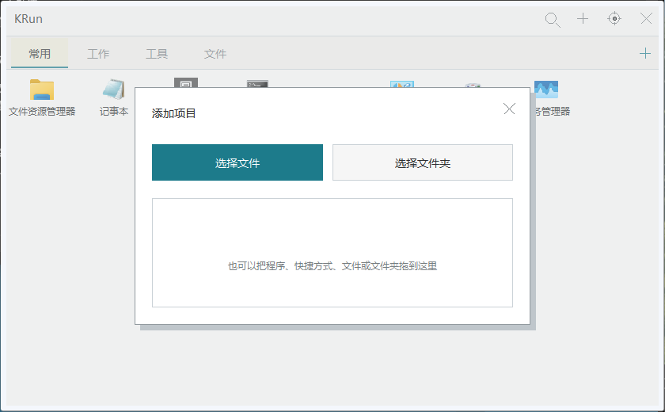

<div align="center">
  
  <h1>KRun</h1>
  <p><strong>原生 · 极简 · 便携 · 开源</strong></p>
  <p>一个使用 Rust 和原生 Win32 API 构建的开源 Windows 分类启动器。</p>

  <p>
    
    
    
    <a href="https://github.com/1227cwx/krun/releases" target="_blank" rel="noopener"></a>
  </p>
</div>

KRun 用一个快捷键呼出你的应用、文件、文件夹与快捷方式。它不依赖 Electron、WebView 或额外 GUI 运行环境，配置与程序放在一起，解压即可使用。

## 预览

以下三张截图均来自当前发布构建的真实 Windows 窗口，使用临时目录中的公开示例配置；不包含个人启动项。官网静态源码位于 [`docs/`](docs/index.html)，提供分类、搜索与设置的交互模拟。

<p align="center">
  
</p>

<table>
  <tr>
    <td width="50%"></td>
    <td width="50%"></td>
  </tr>
</table>

## 为什么选择 KRun

- **轻量原生**：Rust + Win32/GDI，无浏览器内核或额外 GUI 运行环境。
- **快捷呼出**：全局快捷键唤起，分类与搜索在内存中完成。
- **按需加载**：Win32 消息循环；系统图标异步加载并缓存。
- **极简操作**：分类、拖放、搜索和右键操作都集中在一个启动板中。
- **便携配置**：`launcher.json` 固定保存在 EXE 同目录，不依赖安装器。
- **开放源码**：使用 [MIT License](LICENSE)，可以自由使用、修改和分发。

## 功能

### 启动与搜索

- 可配置全局快捷键，默认 `Alt + Q`。
- 搜索已经添加的项目名称和路径，不扫描整块磁盘。
- 支持中文输入、粘贴、字符序列匹配和键盘导航。
- 单击选择、双击运行；也可以关闭双击模式，改为单击运行。
- `Enter` 直接运行当前选中项目。

### 分类与项目

- 分类可自由新建、重命名和删除，不限制固定数量。
- 分类过多时自动提供翻页和完整分类菜单。
- 支持拖入程序、快捷方式、普通文件和文件夹。
- 现代 Windows 文件/文件夹选择器，支持多选。
- 系统高清图标按当前 DPI 异步加载，首次切换分类不会等待 Shell 图标提取。
- 鼠标滚轮浏览当前页面之外的项目。

### 右键菜单

- 运行
- 以管理员身份运行
- 打开方式
- 打开文件所在位置
- 复制完整路径
- 移动到其他分类
- 新建项目
- 按名称排序
- 重命名
- 删除

### 窗口行为

- 通知区域常驻，关闭按钮仅隐藏启动板。
- 单实例运行，重复启动会唤醒现有窗口。
- 点击窗口外自动隐藏；按住 `Ctrl` 时保持显示。
- 窗口内部空白只取消选中，不会隐藏。
- 支持居中显示、自由移动、位置锁定和尺寸调整。
- 记住自由位置与窗口大小，并修正到可见显示器范围。
- Per-Monitor DPI 感知，支持多显示器。
- 淡入淡出和短内容过渡。
- 启动板不出现在任务栏或 `Alt + Tab` 中。

## 下载与使用

KRun 是便携软件，不需要安装。

1. 从 [GitHub Releases](https://github.com/1227cwx/krun/releases) 下载最新压缩包。
2. 解压到具有写权限的目录。
3. 运行 `KRun.exe`。
4. 按 `Alt + Q` 呼出启动板。
5. 将应用、文件或文件夹拖入启动板。

> KRun 会在 EXE 同目录创建 `launcher.json`。请不要把程序放在当前用户没有写权限的目录中。

当前项目尚未提供自动更新器。未签名的本地构建可能触发 Windows SmartScreen 提示。

发布包只包含 `KRun.exe` 与 `LICENSE`，不附带任何 `launcher.json`。下载同一 Release 的 `SHA256SUMS` 后，可在 PowerShell 中运行 `Get-FileHash .\KRun-*-windows-x64.zip -Algorithm SHA256`，与校验文件中的值逐字比较。升级时先退出托盘中的 KRun，再替换 EXE，保留原目录中的配置。

CPU、内存和响应时间尚未进行可复现基准测量，本项目不宣称具体性能数值。

## 键盘操作

| 按键 | 操作 |
| --- | --- |
| `Alt + Q` | 默认显示或隐藏 KRun |
| `Ctrl + F` | 打开搜索 |
| 直接输入 | 进入搜索并输入首字符 |
| `↑` `↓` `←` `→` | 移动选中项 |
| `Enter` | 运行选中项或确认输入 |
| `Backspace` | 编辑搜索文字 |
| `Delete` | 删除选中项目 |
| `Esc` | 关闭浮层、退出搜索、返回或隐藏 |

## 设置

设置页目前提供：

- 全局显示快捷键
- 当前用户开机启动
- 项目双击运行
- 居中显示
- 允许移动
- 允许调整大小

“居中显示”开启时会锁定移动开关。取消居中后，才能启用自由移动并保存窗口位置。

## 配置与隐私

目录结构：

```text
KRun.exe
launcher.json
```

`launcher.json` 保存分类、项目路径、快捷键和窗口位置。配置写入先生成临时文件，再通过 Windows 原子替换覆盖正式文件。

KRun 不上传配置，也不依赖在线账户。开机启动是常规使用中唯一的注册表写入：

```text
HKCU\Software\Microsoft\Windows\CurrentVersion\Run\KRun
```

关闭开机启动时会删除该值。KRun 也会清理属于旧版 QuickLaunch 的兼容启动项。

## 从源码构建

### 环境

- Windows 10/11 x64
- Rust MSVC toolchain
- Visual Studio Build Tools
- Windows 10/11 SDK

### 构建发布版

```powershell
powershell -ExecutionPolicy Bypass -File .\build-release.ps1
```

输出文件：

```text
release\KRun.exe
```

构建脚本不会删除或覆盖已有的 `release\launcher.json`。

### 质量检查

```powershell
cargo fmt --check
cargo clippy --all-targets -- -D warnings
cargo test
```

## 技术架构

- **Rust 2024**：应用与领域逻辑
- **Win32**：窗口、消息循环、热键、拖放与托盘
- **GDI / DWM**：界面绘制、过渡、圆角与阴影
- **Windows Shell / COM**：现代文件选择器和高清系统图标
- **Serde JSON**：便携配置
- **静态 MSVC CRT**：减少外部运行库要求

Release 配置启用了 LTO、单 codegen unit、体积优化、符号裁剪和 `panic = "abort"`。

## 项目结构

```text
assets/                 KRun 图标资源
resources/              Windows RC、manifest 与图标生成脚本
src/                    Rust 源码
  app.rs                应用状态与交互
  render.rs             GDI 绘制
  layout.rs             DPI 感知布局与命中测试
  icon_loader.rs        异步高清系统图标
  shell.rs              Windows Shell 与文件选择器
  config.rs             JSON 配置
build.rs                Windows 资源编译
build-release.ps1       发布构建脚本
```

## 路线图

- 可复现的冷启动、热键响应、内存和 CPU 基准
- 更完整的主题与可访问性支持

仓库已包含 Windows 发布工作流（格式、Clippy、测试、Release 打包和 SHA-256 校验）以及 GitHub Pages 工作流。Pages 是否可启用取决于仓库当前可见性及账户计划，发布状态以 GitHub Actions 为准。

## 贡献

欢迎提交 Issue 和 Pull Request。提交代码前请确保：

```powershell
cargo fmt --check
cargo clippy --all-targets -- -D warnings
cargo test
```

建议一个 PR 只处理一个明确问题，并附上复现方式、行为变化和必要测试。

## License

KRun is licensed under the [MIT License](LICENSE).
